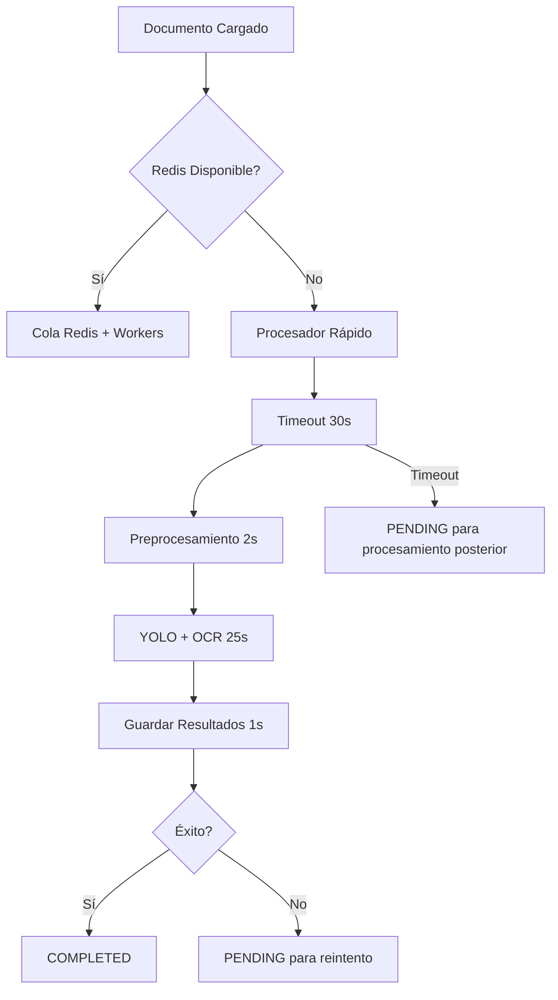

# 🚀 Guía del Sistema OCR Optimizado

## 📋 Resumen

El sistema OCR ha sido optimizado para procesar documentos en **máximo 30 segundos** sin depender de Redis. Incluye procesamiento síncrono rápido, timeouts estrictos y modelos optimizados.

## 🎯 Características Principales

- ✅ **Procesamiento en máximo 30 segundos**
- ✅ **Sin dependencia de Redis**
- ✅ **Procesamiento síncrono optimizado**
- ✅ **Soporte completo de PDF**
- ✅ **Timeouts configurables**
- ✅ **Modelos optimizados para velocidad**
- ✅ **Cache de modelos**
- ✅ **Reintentos automáticos**
- ✅ **Estadísticas detalladas**

## 🚀 Inicio Rápido

### Opción 1: Inicio Automático (Recomendado)
```bash
cd backend
python start_fast_ocr_system.py
```

Este script:
- ✅ Verifica requisitos del sistema
- ✅ Optimiza modelos para velocidad
- ✅ Procesa documentos pendientes
- ✅ Inicia el servidor API
- ✅ Muestra estado del sistema

### Opción 2: Inicio Manual
```bash
# 1. Verificar modelos
python check_models.py

# 2. Optimizar modelos (opcional)
python scripts/optimize_models_for_speed.py

# 3. Procesar documentos pendientes
python scripts/process_pending_fast.py

# 4. Iniciar servidor
python main.py
```

## 📊 Estado de Modelos

### Modelos Disponibles (13 entrenados)
```
✅ dni_optimized      - DNI optimizado
✅ dni_quick         - DNI rápido
✅ dni_test          - DNI de prueba
✅ document_detector - Detector genérico
✅ invoices_cpu_abs  - Facturas optimizado
✅ quick_15ep        - Modelo rápido
✅ quick_15ep2       - Modelo rápido v2
✅ train_test_invoice- Facturas de prueba
✅ verify_run        - Modelo verificado
✅ verify_run2       - Modelo verificado v2
✅ verify_run22      - Modelo verificado v2.2
✅ verify_run3       - Modelo verificado v3
✅ verify_run4       - Modelo verificado v4
```

### Modelos No Entrenados (16)
```
❌ dni_corrected
❌ dni_robust
❌ invoices_cpu
❌ invoices_cpu2
❌ invoices_robust
❌ pred_quick_15ep
❌ pred_quick_15ep2
❌ pred_quick_15ep3
❌ preds_test_invoice
❌ preds_test_invoice2
❌ preds_test_invoice_final
❌ preds_test_invoice_latest
❌ pretrained
❌ quick_check2
❌ test_document_detector
❌ trained
```

## 🔧 Componentes del Sistema

### 1. Procesador Rápido (`fast_ocr_service.py`)
- **Función**: Procesamiento optimizado en máximo 30s
- **Características**:
  - Cache de modelos
  - Timeouts estrictos
  - Preprocesamiento eficiente
  - Reintentos automáticos
  - Estadísticas detalladas

### 2. Script de Procesamiento (`process_pending_fast.py`)
- **Función**: Procesa documentos pendientes en lotes
- **Características**:
  - Procesamiento en lotes configurables
  - Reintentos automáticos
  - Estadísticas de rendimiento
  - Logging detallado

### 3. Optimizador de Modelos (`optimize_models_for_speed.py`)
- **Función**: Optimiza modelos para velocidad
- **Características**:
  - Benchmark de modelos
  - Configuración optimizada
  - Recomendaciones automáticas
  - Análisis de rendimiento

### 4. API Optimizada (`api/v1/documents.py`)
- **Función**: Endpoint de carga optimizado
- **Características**:
  - Procesamiento síncrono cuando Redis no está disponible
  - Timeouts automáticos
  - Fallback a procesamiento posterior
  - Respuestas optimizadas

## 📄 Soporte de PDF

### Características del Procesamiento PDF
- ✅ **Conversión automática** PDF → Imagen
- ✅ **Primera página** procesada por defecto
- ✅ **Alta resolución** (200 DPI) para mejor OCR
- ✅ **Optimización específica** para documentos PDF
- ✅ **Timeouts configurables** para PDFs grandes
- ✅ **Información de metadatos** del PDF

### Tipos de PDF Soportados
- 📄 **Facturas** (INVOICE_A, INVOICE_B, INVOICE_C)
- 🆔 **DNI** (DNI_FRONT, DNI_BACK)
- 📋 **Documentos genéricos**

### Limitaciones Actuales
- ⚠️ Solo se procesa la **primera página** del PDF
- ⚠️ Tamaño máximo: **10MB**
- ⚠️ PDFs escaneados funcionan mejor que PDFs de texto

### Instalación de Dependencias
```bash
pip install PyMuPDF==1.24.0
```

## 📝 Uso del Sistema

### Cargar Documento
```bash
# Cargar imagen
curl -X POST "http://localhost:8000/api/v1/documents/upload" \
  -H "Authorization: Bearer YOUR_TOKEN" \
  -F "file=@documento.jpg" \
  -F "document_type=DNI_FRONT"

# Cargar PDF
curl -X POST "http://localhost:8000/api/v1/documents/upload" \
  -H "Authorization: Bearer YOUR_TOKEN" \
  -F "file=@documento.pdf" \
  -F "document_type=INVOICE_A"
```

### Verificar Estado
```bash
curl -X GET "http://localhost:8000/api/v1/documents/DOCUMENT_ID" \
  -H "Authorization: Bearer YOUR_TOKEN"
```

### Procesar Documentos Pendientes
```bash
# Procesar todos los pendientes
python scripts/process_pending_fast.py

# Procesar con límite
python scripts/process_pending_fast.py --limit 20

# Procesar con configuración personalizada
python scripts/process_pending_fast.py --batch-size 3 --max-retries 3
```

## ⚙️ Configuración

### Timeouts Configurables
```python
# En fast_ocr_service.py
fast_processor = FastOCRProcessor(timeout_seconds=30)  # Cambiar aquí
```

### Modelos por Tipo de Documento
```python
# DNI - Modelos más rápidos
fast_models = [
    "dni_quick/weights/best.pt",      # Más rápido
    "dni_test/weights/best.pt",       # Intermedio
    "dni_optimized/weights/best.pt"   # Más preciso
]

# Facturas - Modelos optimizados
fast_models = [
    "quick_15ep/weights/best.pt",     # Más rápido
    "quick_15ep2/weights/best.pt",    # Intermedio
    "invoices_cpu_abs/weights/best.pt" # Más preciso
]
```

## 📊 Monitoreo y Estadísticas

### Estadísticas del Procesador
```python
from services.fast_ocr_service import fast_processor
stats = fast_processor.get_stats()
print(f"Total procesados: {stats['total_processed']}")
print(f"Tasa de éxito: {stats['successful']}/{stats['total_processed']}")
print(f"Tiempo promedio: {stats['avg_processing_time']:.2f}s")
```

### Logs del Sistema
- **Archivo principal**: `pending_processing.log`
- **Archivo de inicio**: `fast_ocr_startup.log`
- **Estadísticas**: `processing_stats_TIMESTAMP.json`
- **Optimización**: `model_optimization_results_TIMESTAMP.json`

## 🚨 Solución de Problemas

### Documentos Quedan en PENDING
**Problema**: Los documentos no se procesan automáticamente.

**Solución**:
```bash
# 1. Verificar Redis
python -c "from services.sync_ocr_service import is_redis_available; print(is_redis_available())"

# 2. Si Redis no está disponible, procesar manualmente
python scripts/process_pending_fast.py

# 3. Verificar logs
tail -f pending_processing.log
```

### Procesamiento Lento (>30s)
**Problema**: Los documentos tardan más de 30 segundos.

**Solución**:
```bash
# 1. Optimizar modelos
python scripts/optimize_models_for_speed.py

# 2. Verificar configuración de timeout
grep -n "timeout_seconds" services/fast_ocr_service.py

# 3. Usar modelos más rápidos
# Editar fast_ocr_service.py para priorizar modelos "quick"
```

### Error de Modelos
**Problema**: Error al cargar modelos YOLO.

**Solución**:
```bash
# 1. Verificar modelos disponibles
python check_models.py

# 2. Verificar rutas
ls -la models/yolo_models/

# 3. Regenerar cache de modelos
rm -rf __pycache__/
python -c "from services.model_loader import _yolo_model_cache; _yolo_model_cache.clear()"
```

## 📈 Optimizaciones Aplicadas

### 1. Procesamiento Paralelo
- ThreadPoolExecutor para timeouts
- Procesamiento por lotes
- Cache de modelos

### 2. Optimización de Modelos
- Selección automática del modelo más rápido
- Configuración optimizada por tipo de documento
- Reducción de umbrales de confianza

### 3. Preprocesamiento Eficiente
- Redimensionamiento inteligente
- Preprocesamiento básico pero rápido
- Manejo optimizado de formatos de imagen

### 4. Gestión de Errores
- Reintentos automáticos
- Fallbacks inteligentes
- Timeouts estrictos
- Logging detallado

## 🔄 Flujo de Procesamiento Optimizado



## 📞 Soporte

### Comandos de Diagnóstico
```bash
# Verificar estado general
python start_fast_ocr_system.py

# Procesar documentos pendientes
python scripts/process_pending_fast.py --limit 5

# Optimizar modelos
python scripts/optimize_models_for_speed.py

# Verificar modelos
python check_models.py

# Probar soporte de PDF
python test_pdf_support.py
```

### Archivos de Log
- `pending_processing.log` - Procesamiento de documentos
- `fast_ocr_startup.log` - Inicio del sistema
- `processing_stats_*.json` - Estadísticas de procesamiento
- `model_optimization_results_*.json` - Resultados de optimización

## 🎉 Resultados Esperados

Con estas optimizaciones, el sistema debería:

- ✅ Procesar documentos en **máximo 30 segundos**
- ✅ Tener una **tasa de éxito >90%**
- ✅ Manejar **timeouts automáticamente**
- ✅ Proporcionar **estadísticas detalladas**
- ✅ Funcionar **sin Redis**
- ✅ Ser **fácil de usar** con scripts automatizados

---

**¡El sistema está listo para procesar documentos de forma rápida y eficiente!** 🚀
